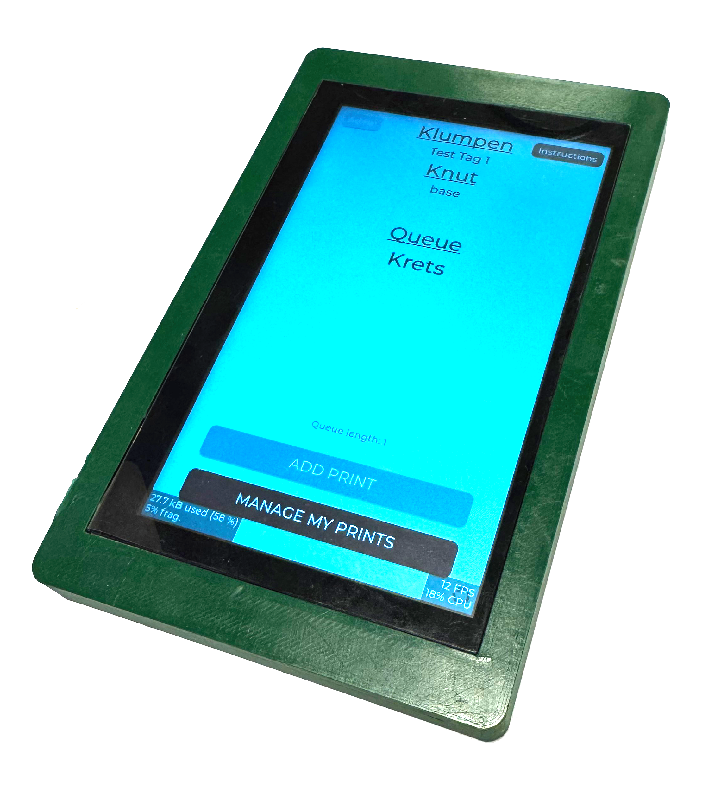
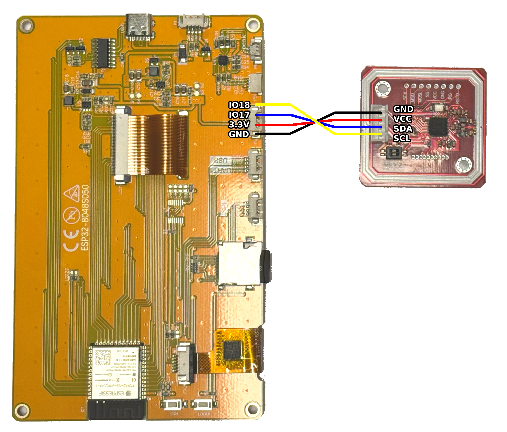

# LMS 3DPrint Queue
<div style="display: flex; align-items: center;">

<div style="display: inline-block; vertical-align: top; width: 70%;">

  <p>A queue system for the 3D Printers at Lindholmens Makerspace at Chalmers University of Technology, developed by Krets (Flawl3ssSWE) and Taktik (CodyMarvelous).</p>

  <p>A simple touchscreen-based queue system for keeping track of who is next in the queue to use the 3D printers. A user is added to the print queue by scanning their union card (RFID card). To claim a printer, simply press the name of the person in the queue and then the printer (more instructions available on the screen).</p>

</div>

<div style="display: inline-block; vertical-align: top; width: 25%; margin-left: 20px;">
  
</div>


</div>

# Bill of materials
* **Touchscreen:** ESP32-8048S050C
* **RFID Card Reader:** PN532 
* **Database storage:** Micro SD Card

# Libaries
This project uses a couple of different libraries
* SQLite3 Arduino Library for ESP32 - [Link](https://github.com/siara-cc/esp32_arduino_sqlite3_lib)
* PN532 - [Link](https://github.com/picospuch/PN532)
* ESP32-Smartdisplay - [Link](https://github.com/rzeldent/esp32-smartdisplay)
* LVGL 8.4.0 - [Link](https://github.com/lvgl/lvgl/releases/tag/v8.4.0)

The touchscreen interface was designed in SquareLine Studio, project files are provided if any modifications are desired.

# Small Setup Guide
1. Put the ```DB-Example.db``` on the Micro SD Card.
2. Plug in the SD Card into the screen.
3. Flip the switches on the PN532 to I2C mode.
4. Plug the cables according to the wiring diagram below for connecting the PN532 to the touchscreen.
5. Configure the WiFi settings and salt in the ```TotalltNotJonatansMasterPassword.h```.
6. Enable debugging mode in the code, by uncommenting all the ```#define DEBUG``` in the code.
7. Flash the project with PlatformIO onto the ESP32
8. Connect to the touscreen to a serial monitor, baudrate ```250000```.
9. Scan a RFID card and take note of the produced hash.
10. Unplug everything, and put in the SD Card into a computer.
11. Open the database file and modify the uniquieSHA256ID for the user present in the users table, with the noted hash.
12. Plug the SD Card back into the touchscreen
13. Disable debugging, by commenting out all of the ```#define DEBUG``` again and reflash the firmware.
14. Done!

# Wiring
Make sure so that the PN532 is set to the I2C mode!

<div style="display: flex; align-items: center;">
  <table>
    <thead>
      <tr>
        <th>Touchscreen</th>
        <th>RFID Reader</th>
      </tr>
    </thead>
    <tbody>
      <tr>
        <td>IO18</td>
        <td>SCL</td>
      </tr>
      <tr>
        <td>IO17</td>
        <td>SDA</td>
      </tr>
      <tr>
        <td>3.3V</td>
        <td>VCC</td>
      </tr>
      <tr>
        <td>GND</td>
        <td>GND</td>
      </tr>
    </tbody>
  </table>

  
</div>

# Credit
A big thank you to rzeldent for writing the excellent library for using the screen and a demo to show how to use the screen: [Link](https://github.com/rzeldent/esp32-smartdisplay-demo)

# Notes
SHA-256 is used for hashing. If this is to be deployed in a public scenario, considerations should be made regarding whether a more appropriate hashing algorithm should be used. However, since a requirement of this project was to only use the UID from RFID cards, the number of possible UID combinations is very small. This makes alternatives such as bcrypt or Argon2 only slightly better. To add some complexity, a salt is used to increase the time required to brute-force the correct UIDs.